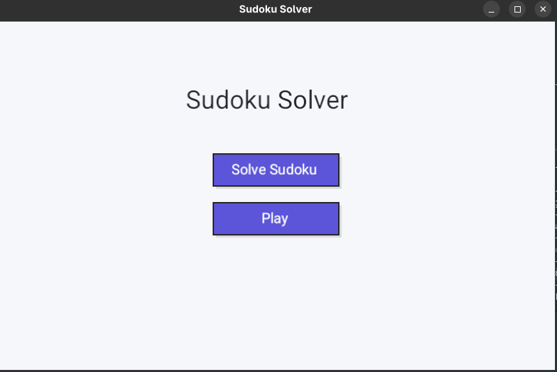
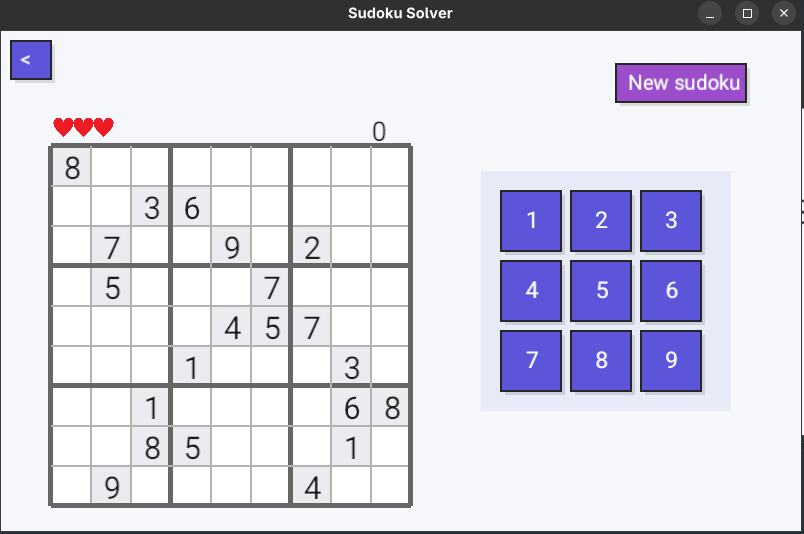
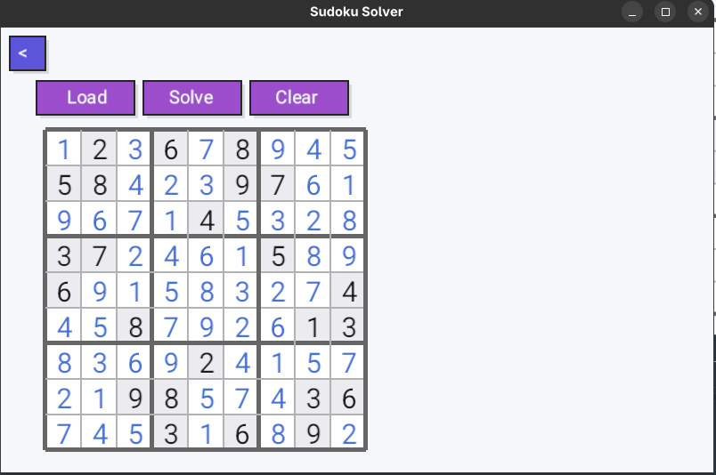

# Sudoku Game

> **Language:** Rust | **Graphics Engine:** Piston Window | **Doc Version:** 1.0

---

## Table of Contents

1. [Project Overview](#1-project-overview)
2. [How to run](#2-how-to-run)
3. [Screenshots](#3-screenshots)
4. [Project Architecture](#4-project-architecture)
5. [Solver algorithm](#5-solver-algorithm)
6. [Dependencies](#6-dependencies)

---

## 1. Project Overview

This project is a Sudoku game built in Rust using the Piston Window graphics library. 
It offers two modes: a **Play mode** where the user fills in the grid, and a **Solver mode** that automatically solves a given grid.

### Main Features

- Main menu with click-based navigation
- **Play mode**: interactive digit input in the grid
- **Solver mode**: automatic grid resolution
- Interactive buttons with hover effects
- Smooth 2D rendering via Piston Window

---
## 2. How to run

Git clones the repository and runs the following command in the project directory:
```bash
cargo run
```

---

## 3. Screenshots





---

## 4. Project Architecture

The project is split into several Rust modules, each responsible for a specific part of the application.

| File | Role                                             |
|------|--------------------------------------------------|
| `main.rs` | Entry point, Piston game loop                    |
| `app_state.rs` | Global application state (mouse position, etc.)  |
| `menu_state.rs` | Main menu logic and rendering                    |
| `button.rs` | Reusable `ButtonRect` component                  |
| `display.rs` | Visual constants, title rendering and utilities  |
| `grid.rs` | Core Sudoku grid representation and validation logic |
| `solver.rs` | Backtracking solver implementation |
| `play_state.rs` | Game interaction logic |
| `solver_state.rs` | Solver visualization state |
| `win_state.rs` | Win screen state |
| `lost_state.rs` | Lose screen state |
| `parser.rs` | Grid parsing from input |
| `error.rs` | Custom error handling |
---

## 5. Solver algorithm

The solver uses a classic **backtracking** algorithm:

1. Find an empty cell
2. Try digits from 1 to 9
3. Check if the digit is valid (row, column, 3x3 box)
4. Recurse
5. Backtrack if no valid digit is found  
  
---

## 6. Dependencies

The project uses the following Rust crates, declared in `Cargo.toml`:

| Crate | Version | Usage |
|-------|---------|-------|
| `piston_window` | latest | Window, 2D rendering, event handling |
| `piston2d-graphics` | latest | Graphic primitives (rectangles, text) |
| `find_folder` | latest | Asset location (fonts) |

---

## Author:  
- [Hélène Houplain](https://github.com/Houpsi)
